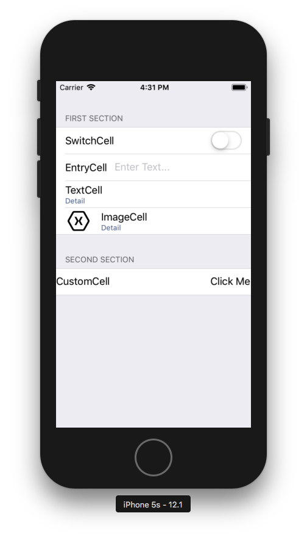

# 04 - TableView

An application which explores the TableView UI element in Xamarin.Forms.

## Overview

*TableView* displays a scrollable lists of data or choices where each row don't share the same template. The view handles scrolling and can lay out rows in distinct sections. It does not have the concept of an ItemsSource, so items must be added as children manually. TableView is useful when:

- presenting a list of settings,
- collecting data in a form, or
- showing data that is presented differently from row to row (e.g. numbers, percentages and images).

### Built-in Cells

The following cells come built-in for collecting and displaying information.

| Cell  | Description  |
|:--|---|
| SwitchCell | Presents and captures a true/false state, along with a text label. |
| EntryCell | Presents and captures text, along with a text label. |
| TextCell | A cell for displaying text, optionally with a second line as detail text. |
| ImageCell | A cell which displays text, a optional detail text, and an image to the left. |

### Custom Cells

Custom cells can be used to present and capture data in the way that makes sense for your app. A *ViewCell* can be customized with UI views such as text labels, images, sliders etc.

## Resources

[TableView](https://docs.microsoft.com/en-us/xamarin/xamarin-forms/user-interface/tableview)
